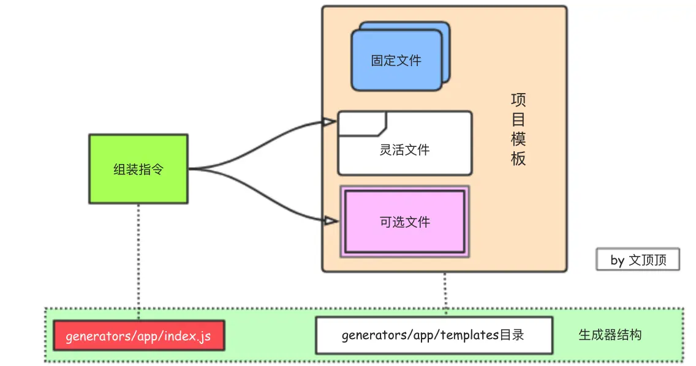

# Yeoman-generator的内部结构
搞清楚 generator的价值所在和应用场景之后，我们就可以开始谈论generator相关的话题了，前面介绍过Yeoman脚手架工具的作用是帮助我们依据特定的技术栈需求来初始化项目，在安装了yo工具之后，只需要在终端中使用类似$ yo generator--xx的命令先安装对应的generator然后再$ yo xx搭建即可。至于如何找到匹配当前技术选型的generator，可以去官网的generator列表搜索，这些生成器中有很大一部分来自于对应框架的作者或者Yeoman官方团队，质量有保证且更新很及时。当然，我们也可以创建自己的generator并发布。关于如何创建自己的generator，我们放到另一篇文章Yeoman脚手架生成器创建来解决。

简单说Yeoman做的工作其实就是根据当前的生成器（generator）来复制固定的项目模板文件到新项目中，而新项目中的某些文件需要配置，这部分工作由安装时候的交互式指令来完成（相当于传递参数给模板文件）。

需要注意的是，Yeoman的设计仅仅只提供了一小部分核心的API，而真正繁重的初始化工作是交给每个具体的generator来完成的。

generator主要由组装指令和项目模板两部分组成。

## 组装指令

Yeoman generator中的generators/app/index.js文件是整个生成器的核心部分，该文件用于告知Yeoman该如何来组织并搭建项目，我们可以在该文件中设置初始化项目时必要的安装提示和选项来让用户选择，以及每个文件应该如何复制和修改，是否需要加载依赖和Node包等内容。

## 项目模板

项目模板包括初始化项目需要的所有必须文件。这些文件又可以简单的划分为固定文件、灵活文件、可选文件和依赖文件。所谓固定文件就是在每个初始项目中都一模一样的文件，譬如index.js、style.css等文件，在具体处理的时候这些文件只需要简单复制即可。灵活文件指的是那些需要根据用户选择来做简单修改然后才能复制的文件，譬如index.html文件（title等信息需根据用户输入来指定）。对于可选文件来说，它们并不是必须的，譬如某些基础框架有的项目中需要，有的项目中也许并不需要，这部分文件的处理方式需要交给用户来决定。

## 项目模板文件的类别
前面已经介绍过了Yeoman生成器的组成部分主要是组装指令和项目模板。对于整个Yeman脚手架工具来说，项目模板这部分就相当于是搭建脚手架需要用到的原材料，而组装指令用来决定和控制所有的具体行动是什么。

现在我们开始深入的来讨论项目模板这部分内容，需要先明白的是“能够满足所有需求的万能的项目模板是不存在的”。因为这世界上每个项目组，每个产品甚至每个人的需求(要求)都各有不同。所以，在实践中你必须要对当前项目的需求和采用的技术栈有深入的理解，这样你才能知道目标项目的目录结构会是什么样的? 哪些文件是必不可少的。

如果你的项目和采用的技术栈比较大众化，那么搜索一个合适的generator基本就能满足需求，拿来主义即可。如果你的项目不管结构还是所采用的技术看上去都那么的非凡和特别，那么就多花一点点时间创建个自己的generator吧，如果你需要处理多个这样的项目，那就更应该了。在创建或者理解generator的时候，我们可以根据前面对项目模板文件的划分情况来区别对待不同的文件。

### 固定文件

固定文件是在每个项目中初始内容都一样的必要文件。

比如我们可能总是会把代码的结构划分为src、build和dist三个目录，在src目录下面拥有js、css和lib文件目录，index.js和style.css等文件。这些文件都是必要的，刚开始的时候可能是空的或者只有几行简单的代码。这些文件的特点是，在使用组装指令操作(通常是复制-移动)这些文件的时候，不需要对它们进行任何的修改。

### 灵活文件

灵活文件和固定文件差不多，也是初始化项目所必须的，但不同的项目中这些文件的内容也会稍有不同，这些不同之处可能很细微(比如仅仅是名字、协议这些)，也可能差异巨大。比如，我们常用的构建工作流中的bower.json和package.json文件，它们是必不可少的，但是它们都需要当前项目的项目名称和协议等信息才能正常工作。像这样的灵活文件还有index.html，在这个文件中的title标签中应该使用当前项目的名称。

灵活文件中的部分内容需要在安装该生成器的时候，由用户交互式配置输入的信息来进行设定。

### 可选文件

可选文件并不是搭建初始化项目时所必须的文件，如果没有那么没关系，如果有那似乎更好。这些一般在用户交互式配置的时候，以是否题的方式交由用户决定，譬如是否使用less 是否安装Bootstrap等。

### 依赖文件

依赖文件指的是某些常用的框架、插件或者是Node模块，这些文件并不需要你在项目模板文件中提供，然后通过组装指令去一个个复制。因为基本上成熟的项目中都会使用既定的工作流(主要包括依赖和包的下载、项目的自动化构建等)，所以我们完全只需要在package.json或者bower.json等文件中设置好依赖即可，然后在组装指令的相关代码中通过this.installDependencies（）类似的代码来调用npm或者是bower执行install命令即可。

## yeoman脚手架运转的核心机制

当您为项目准备好(搜索或自己创建)合适的generator之后，就可以用它们来搭建项目了。generator的执行需要在终端中使用yo命令来操作。yo是Yeoman的核心命令，主要用来连接生成器和项目结构。我们可以把yo命令理解为generator的执行器，它知道怎么找到对应的generator，也知道该如何执行它们。

注意：yo基于NodeJS且需要在任何文件目录中使用，所以在安装yo命令的时候应该使用-g来进行全局安装。安装过程请参考：Yeoman脚手架使用入门。

在使用yo命令行工具和生成器来初始化项目之前，需要先把指定的生成器(generator)下载安装到本地（如果是自己创建的生成器，那么可以通过$ npm link命令以软连接的方式生成一个全局的npm包，我的是mac OSX系统，生成的npm包会保存在/usr/local/lib/node_modules/路径，如果使用的是别人发布的generator，那么请使用$ npm install -g generator-xxx的方式来安装）。

这里需要注意的是yo命令行工具主要负责前期工作，在使用的时候它主要检查当前安装的generator有哪些，指定的generator是否能够正常工作，如果能，那么它就会调用generator的组装指令，把剩下部分的工作交接给generator来完成。generator接管项目的组装流程之后，会按app/index.js中的要求来处理文件的复制等工作。

下面给出脚手架工具初始化项目时的核心流程。

https://www.jianshu.com/p/8d90fac23c47
